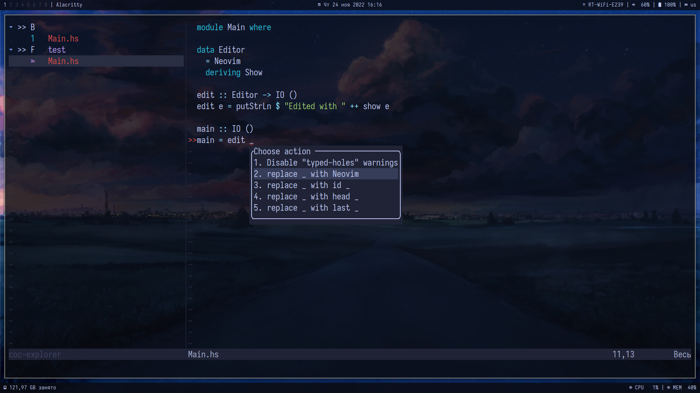

# Neovim configuration

My Neovim looks like this:

Features:

- :inbox_tray: Plugin manager:
[packer](https://github.com/wbthomason/packer.nvim)

- :pencil: Completion engine:
[Coc](https://github.com/neoclide/coc.nvim)

- :art: Color scheme:
[Tokyo Night](https://github.com/folke/tokyonight.nvim)
