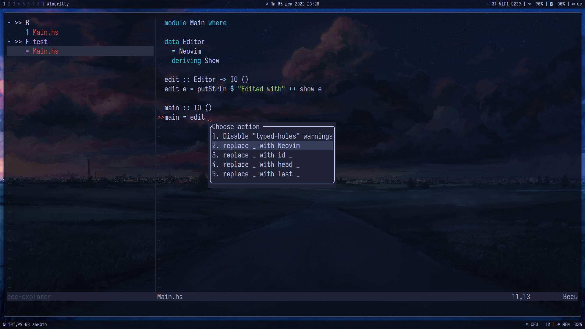

# Neovim configuration

My Neovim looks like this:

## Features

As a plugin manager [packer](https://github.com/wbthomason/packer.nvim) is
used. Completion, Language Server Protocol support and other kinds of magic
are provided by [coc](https://github.com/neoclide/coc.nvim). As a color
scheme [Tokyo Night](https://github.com/folke/tokyonight.nvim) is set.

## Extensions

The following coc extensions are enabled:

- [coc-clangd](https://github.com/clangd/coc-clangd)
- [coc-explorer](https://github.com/weirongxu/coc-explorer)
- [coc-json](https://github.com/neoclide/coc-json)
- [coc-pyright](https://github.com/fannheyward/coc-pyright)
- [coc-rust-analyzer](https://github.com/fannheyward/coc-rust-analyzer)
- [coc-sumneko-lua](https://github.com/xiyaowong/coc-sumneko-lua)
- [coc-texlab](https://github.com/fannheyward/coc-texlab)
- [coc-yaml](https://github.com/neoclide/coc-yaml)
